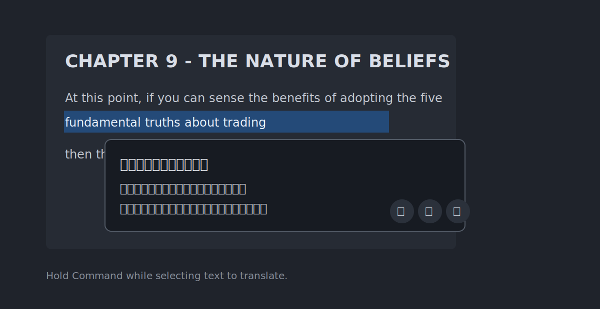
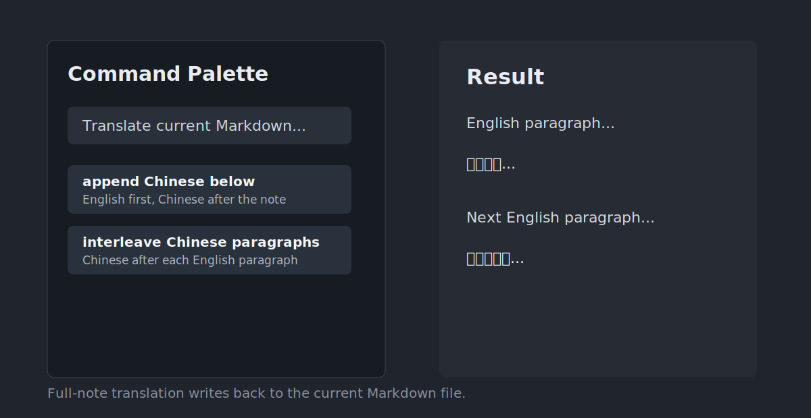
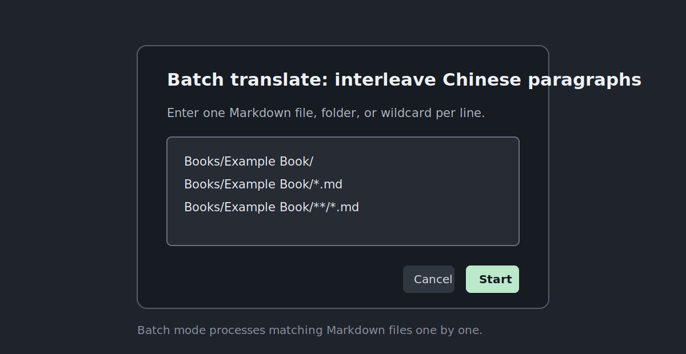

# Codex Local Translator for Obsidian

Translate selected text, whole notes, or batches of Markdown files in Obsidian through a locally logged-in AI coding assistant CLI.

> This is an unofficial community plugin. It is not affiliated with OpenAI or Obsidian.



## What It Does

- Translate selected Markdown to Simplified Chinese.
- Show a translation popup only when you hold `Command` while selecting text.
- Look up a selected English word with instant local/cache definitions and optional AI context explanation.
- Translate selected text from Obsidian-readable PDFs when the PDF text layer can be selected.
- Extract public YouTube subtitles from a note URL into a Markdown transcript note.
- Read selected English text aloud with the system text-to-speech voice.
- Save selected passages to an excerpt note with source file and line references.
- Translate the current Markdown file and append the Chinese version below the original.
- Translate the current Markdown file into interleaved English/Chinese paragraphs.
- Batch translate multiple Markdown files by file path, folder path, or wildcard.
- Use Codex or Claude Code without API keys.
- Show actual token usage after AI-powered translation or vocabulary explanation when the local backend reports it.
- Use a custom prompt/context for book, domain, terminology, or style guidance.

## Requirements

- Obsidian desktop. This plugin is desktop-only.
- Codex installed locally, either through Codex.app or the Codex CLI, or Claude Code installed locally.
- A local login for the backend you use: Codex with your ChatGPT account, or Claude Code with your Claude account.

This plugin does not use OpenAI or Anthropic API keys. It shells out to local `codex` or `claude` executables and uses your existing local login.

## Privacy And Data

Selected text and Markdown file contents are sent to the configured backend for translation through the local executable. This is not offline translation.

The plugin stores only local plugin settings in your vault, such as model name, timeout, excerpt note path, and custom prompt. It does not store API keys.

Batch and full-file commands write directly to your Markdown files. Back up your vault before running bulk operations on important notes.

## Screenshots

### Selection Popup

Hold `Command` while selecting text to show a translation popup. The popup includes read-aloud, excerpt, and copy actions.
For single English words, the popup shows a local/cache vocabulary note first and can enrich it with Codex or Claude Code using the current paragraph as context.


### Full Note Translation

Full-note commands can append the full Chinese translation at the bottom or insert Chinese text after each source paragraph.



### Batch Translation

Batch commands accept one file, folder, or wildcard per line.



## Commands

- `Translate selection to Chinese`
- `Append Chinese translation below selection`
- `Speak selected English text`
- `Save selection to excerpts`
- `Translate current Markdown file: append Chinese below`
- `Translate current Markdown file: interleave Chinese paragraphs`
- `Batch translate Markdown files: append Chinese below`
- `Batch translate Markdown files: interleave Chinese paragraphs`
- `Extract YouTube subtitles from current note`
- `Check Codex login`

## Batch Scope Examples

Batch commands accept vault-relative paths, not absolute filesystem paths:

```text
Books/Example Book/
Books/Example Book/08 - Chapter 1.md
Books/Example Book/*.md
Books/Example Book/**/*.md
```

Supported scope types:

- Single Markdown file.
- Folder, recursively including Markdown files inside it.
- Simple wildcard such as `*.md`.
- Recursive wildcard such as `**/*.md`.

## Settings

- `Auto translate selection`: show a popup after text is selected.
- `Require Command key for auto translate`: only show the popup when `Command` is held during selection. Enabled by default.
- `AI backend`: `Auto`, `Codex`, or `Claude Code`. Auto uses Codex when available, then falls back to Claude Code.
- `Custom prompt / context`: add book, topic, terminology, style, or translation preferences.
- `Excerpt file`: vault path for saved passages.
- `YouTube transcript folder`: vault folder for extracted subtitle notes.
- `Open excerpt file after saving`: open the excerpt note in a right-side split.
- `Include translation in excerpts`: save the popup translation when available.
- `Speech language`: defaults to `en-US`.
- `Speech rate`: defaults to `0.92`.
- `Codex command`: leave empty to auto-detect Codex.app or a local CLI.
- `Claude command`: leave empty to auto-detect Claude Code.
- `Model`: defaults to `gpt-5.4-mini`.
- `Claude model`: defaults to `claude-sonnet-4-5`.
- `Reasoning effort`: defaults to `none`.
- `Timeout`: maximum seconds for each AI invocation.
- `Single-shot translation limit`: notes under this character count are translated in one request.
- `Batch chunk size`: larger chunks reduce process startup overhead and repeated prompt tokens.

Example custom prompt:

```text
I am reading a trading psychology book. Translate in natural Simplified Chinese,
preserve Markdown structure, and keep recurring trading terms consistent.
```

## Local Development

Install dependencies:

```bash
npm install
```

Build:

```bash
npm run build
```

Manual install for development:

```text
<vault>/.obsidian/plugins/codex-local-translator/
```

The plugin folder must contain:

- `manifest.json`
- `main.js`
- `styles.css`

## Release Checklist

For an Obsidian Community Plugin release:

1. Update `manifest.json` and `versions.json`.
2. Run `npm run build`.
3. Commit `main.js`, `manifest.json`, `styles.css`, and source files.
4. Create a GitHub release whose tag exactly matches `manifest.json` version, for example `1.0.0`.
5. Upload release assets:
   - `main.js`
   - `manifest.json`
   - `styles.css`
6. Submit the public repository URL through the Obsidian Community directory.

## License

MIT
